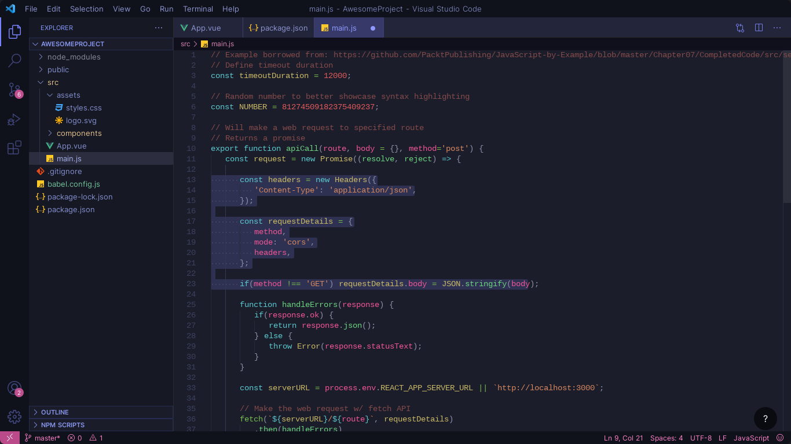
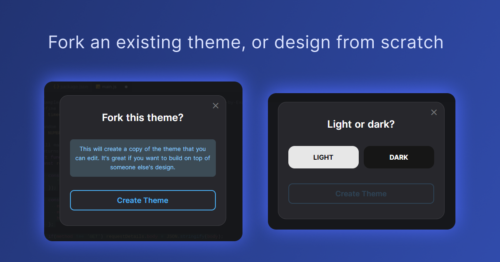
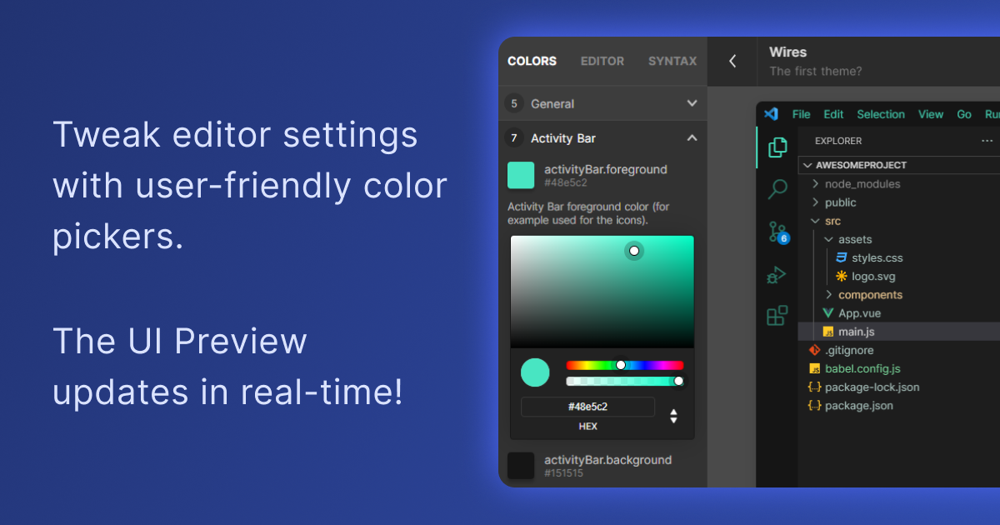
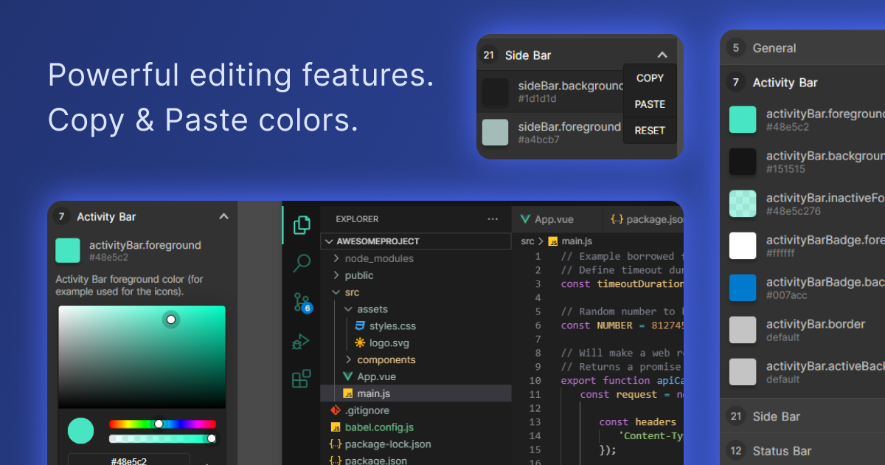

# Plum Dark Theme
###### A violet and blue theme for VS Code.
By: Mike Tromba

### [Created using the Theme Studio for VS Code](https://themes.vscode.one)

### [Create Your Own Theme](https://themes.vscode.one)